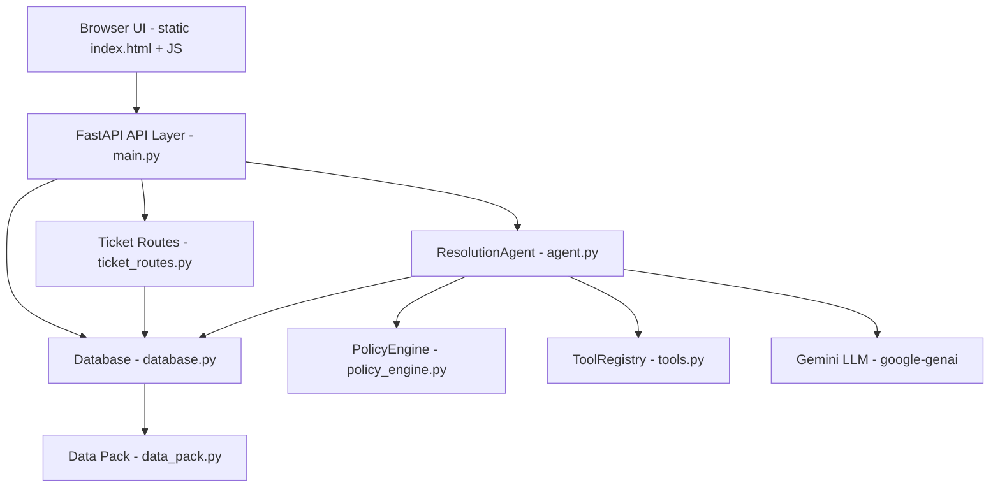
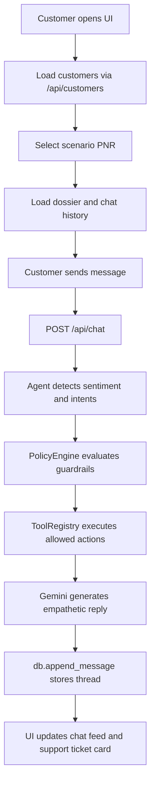
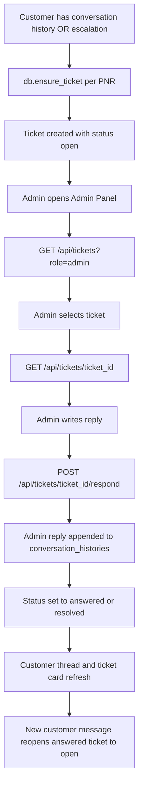
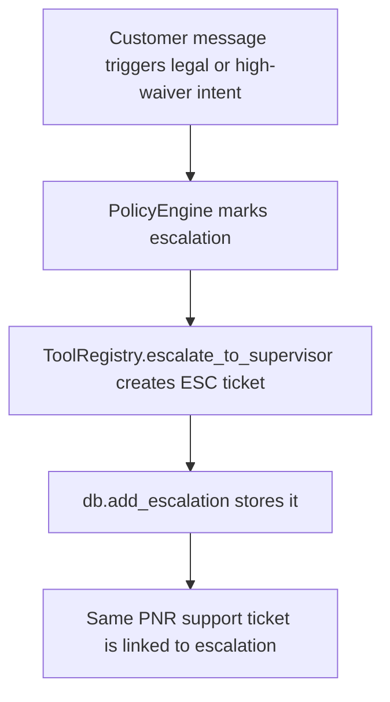

# AeroResolve AI — Architecture & Process Flow Analysis

> Deep analysis document for the **Airline-assistant** project (`AeroResolve AI`).
> Scope: customer-facing airline disruption resolution agent + Admin Panel support-ticket system.

---

## 1. Project Overview

AeroResolve AI is a single-page web application backed by a FastAPI service that simulates an autonomous, policy-grounded airline disruption resolution agent named **Ishan**. The agent handles flight cancellations and delays for pre-seeded assignment customers and custom passengers, and an **Admin Panel** treats each customer complaint as a support ticket that an admin can answer.

**Core technologies**

| Layer | Technology |
| :--- | :--- |
| Runtime LLM | Google Gemini (`gemini-3.1-flash-lite`) via `google-genai` |
| Backend | Python 3.10+, FastAPI, Uvicorn, Pydantic |
| Frontend | Vanilla JavaScript ES modules, HTML5, CSS3 |
| Storage | In-memory stores (no external database) |
| Testing | Python `assert`-based scenario suite + FastAPI `TestClient` |

---

## 2. System Architecture

The application follows a layered architecture with a clear separation between the AI decision layer, policy engine, tool execution layer, data layer, API layer, and the browser UI.

### 2.1 Frontend layer

| File | Responsibility |
| :--- | :--- |
| [`static/index.html`](static/index.html:1) | App shell, layout, modals, Admin Panel overlay, customer ticket modal |
| [`static/js/app.js`](static/js/app.js:8) | Application controller: scenario selection, chat, ticket card, admin panel, customer ticket thread |
| [`static/js/components.js`](static/js/components.js:5) | Pure HTML renderers for passport, HUD, action cards, escalations, ticket list/detail/thread |
| [`static/js/api.js`](static/js/api.js:7) | Fetch-based API client for all `/api/*` endpoints |
| [`static/css/style.css`](static/css/style.css:5) | Design system, layout, chat bubbles, admin panel, ticket styles |

### 2.2 API layer

| File | Responsibility |
| :--- | :--- |
| [`main.py`](main.py:1) | FastAPI app, static serving, customer/chat/escalation/reset endpoints, mounts ticket router |
| [`backend/ticket_routes.py`](backend/ticket_routes.py:1) | Admin Panel ticket endpoints with role-flag guards |

### 2.3 Domain / AI layer

| File | Responsibility |
| :--- | :--- |
| [`backend/agent.py`](backend/agent.py:229) | `ResolutionAgent`: Gemini generation, sentiment/intent detection, guardrails, tool orchestration |
| [`backend/policy_engine.py`](backend/policy_engine.py:9) | Pure policy rules: cancellation, delay compensation, refunds, fare difference, loyalty, legal threats |
| [`backend/tools.py`](backend/tools.py:8) | Concrete business actions: vouchers, lounge, hotel, refund, rebooking, escalation |

### 2.4 Data layer

| File | Responsibility |
| :--- | :--- |
| [`backend/data_pack.py`](backend/data_pack.py:1) | Static assignment data: 3 customers, service policies, allowed/prohibited actions |
| [`backend/database.py`](backend/database.py:12) | In-memory `customers`, `conversation_histories`, `escalations`, `tickets` stores |
| [`backend/models.py`](backend/models.py:1) | Ticket serialization, thread assembly, status constants |

---

## 3. Process Flows

### 3.1 Customer conversation flow

### 3.2 Support-ticket lifecycle

### 3.3 Escalation flow

---

## 4. AI Tools & Input Sources Used

### 4.1 AI tools used during analysis and development

| Tool | Purpose in this work |
| :--- | :--- |
| **ChatGPT** | Reasoning, design decisions, and solution planning for the Admin Panel feature |
| **Antigravity editor** | Primary code editor used to author and review the source files |
| **Google Gemini `gemini-3.1-flash-lite`** | Runtime LLM used by `ResolutionAgent` to generate the customer-facing empathetic replies |
| **FastAPI / Uvicorn / Pydantic** | Backend framework and request/response validation |
| **Python `assert` test suite + FastAPI TestClient** | Automated verification of policies, scenarios, and ticket APIs |
| **Node.js `--check`** | JavaScript syntax validation for the frontend modules |

### 4.2 Input sources consumed for the analysis

| Input source | Detail |
| :--- | :--- |
| [`README.md`](README.md:1) | Project purpose, assignment scenario coverage, policy summary |
| [`backend/data_pack.py`](backend/data_pack.py:1) | Seed customers, service policies, allowed/prohibited actions |
| [`backend/agent.py`](backend/agent.py:1) | Agent behavior, prompt construction, tool orchestration logic |
| [`backend/policy_engine.py`](backend/policy_engine.py:1) | Threshold rules and guardrails |
| [`backend/database.py`](backend/database.py:1) | Existing data model and persistence |
| [`static/js/api.js`](static/js/api.js:1) | Existing frontend-to-backend API contract |
| [`static/index.html`](static/index.html:1) | Existing UI structure and component IDs |
| [`static/js/app.js`](static/js/app.js:1) and [`static/js/components.js`](static/js/components.js:1) | UI controller and renderer patterns |
| User instructions | Admin Panel requirements, role access, ticket-creation semantics |

---

## 5. Assumptions Used in the Deep Analysis

1. **No real authentication.** Role-based access uses a simple `role` flag on requests (`admin` vs `customer`). No login, sessions, or tokens, as requested.
2. **One ticket per customer PNR.** A support ticket is auto-created/updated whenever a customer has conversation history or an escalation; the ticket thread is the PNR's full message history.
3. **In-memory persistence is acceptable.** The project intentionally uses an in-memory `Database` singleton; all state resets on server restart.
4. **Server file was missing on disk.** `main.py` was referenced by the README but did not exist, so a FastAPI entrypoint was created to serve static files, existing `/api/*` routes, and the new ticket router.
5. **Existing API contract must be preserved.** The frontend already expected `/api/info`, `/api/policies`, `/api/customers`, `/api/history/{pnr}`, `/api/chat`, `/api/escalations`, and `/api/reset`; these were recreated in [`main.py`](main.py:1).
6. **Ticket status flow.** Statuses are `open`, `answered`, and `resolved`. An admin reply moves `open` to `answered` (or `resolved` if the resolve flag is set); a new customer message reopens an `answered` ticket to `open`.
7. **Admin reply visibility.** Admin responses are appended to the customer's `conversation_histories` as `role: "admin"` so the existing customer chat feed and ticket thread show them.
8. **Gemini is the source of empathetic replies.** The agent never returns hardcoded scenario text; if Gemini is unavailable it falls back to a generic offline retry message.
9. **Frontend updates on refresh/action.** Ticket card and thread views refresh after sending a message, selecting a scenario, responding as admin, and resetting the system.
10. **UI simplification.** The Agent Brain HUD, guardrail pill, Flight Radar, and supervisor queue were removed from the customer view; only the support-ticket queue message and ticket structure remain.

---

## 6. Key API Contract

| Method | Endpoint | Access |
| :--- | :--- | :--- |
| `GET` | `/api/tickets?role=admin` | Admin: all tickets |
| `GET` | `/api/tickets?role=customer&pnr={pnr}` | Customer: own tickets |
| `GET` | `/api/tickets/{ticket_id}?role=...&pnr=...` | Full thread + status history |
| `POST` | `/api/tickets/{ticket_id}/respond` | Admin-only reply |

---

## 7. Conclusion

The AeroResolve AI system cleanly separates policy enforcement, AI generation, tool execution, and UI rendering. The added Admin Panel extends the same layered pattern: the API layer exposes role-guarded ticket endpoints, the data layer maintains the ticket lifecycle, and the frontend renders the admin queue and customer ticket thread without introducing new infrastructure.
